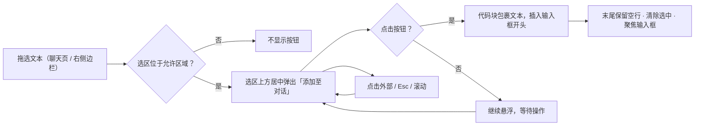

<div align="center">

# dsh-session-plus

**会话增强插件：一键打开工作区 · 模型提供商菜单头部 · 选中文本加入对话**

[](README.md)
[](README_en.md)


</div>

**dsh-session-plus** 是 [DeepSeek Harness](https://github.com/deepseek-ai)（DSH）的会话增强插件，为聊天会话页提供三项轻量增强：

- 🗂 在系统文件管理器中**一键打开**当前会话的工作区目录
- 🏷 模型选择菜单顶部**实时展示**当前请求使用的模型提供商
- ✂️ 选中任意文本，一键以 Markdown 代码块形式**加入输入框开头**

## 📑 目录

- [✨ 功能特性](#-功能特性)
- [🚀 快速开始](#-快速开始)
- [📖 使用说明](#-使用说明)
- [🧪 测试](#-测试)
- [🗂 项目结构](#-项目结构)
- [🛠 技术栈](#-技术栈)
- [🧭 路线图](#-路线图)
- [📄 许可证](#-许可证)

---

## ✨ 功能特性

### 1️⃣ 一键打开工作区

| 特性 | 说明 |
|---|---|
| 一键直达 | 会话页头部右上角新增图标按钮，位于 Session log 下载按钮左侧 |
| 平台自适应图标 | macOS 显示 Finder 图标，Windows / Linux 显示文件夹图标（纯图标、无文字） |
| 平台原生命令 | macOS `open` · Windows `explorer` · Linux `xdg-open` 兜底 |
| 工作区口径准确 | 读取会话的 `session.header.cwd`，与会话 bash 工作目录完全一致 |
| 结果反馈 | 仅失败时右下角 toast 说明原因；成功静默（文件管理器已打开即反馈） |
| 安全防护 | host API 仅接受回环 / 受信主机 + 同源请求；浏览器仅传 sessionId，路径由服务端解析 |

### 2️⃣ 模型提供商头部

| 特性 | 说明 |
|---|---|
| 菜单头部展示 | 模型选择菜单最上方注入 `提供商：xxx` 说明行，一眼看清当前请求走哪家 |
| 显示名优先 | 使用模型目录中的提供商显示名（与菜单内分组标题同源）；目录缺失时回退原始 provider id |
| 实时跟随 | 菜单打开期间订阅会话模型目录，切换模型 / 提供商后头部即时更新 |
| 空态占位 | 目录尚未加载出选中时显示「—」，加载完成后自动变为提供商名 |
| 双语文案 | 随界面语言自动切换（简体中文 / English） |
| 只读无侵扰 | 纯展示、不可交互、不可聚焦；不触碰自带菜单的行为与样式，`/model` 弹出选择器保持原样 |

### 3️⃣ 选中文本 → 添加至对话

| 特性 | 说明 |
|---|---|
| 悬浮按钮 | 在**聊天页消息区**或 **better-sidebar 右侧边栏**中选中文本，选区上方居中弹出「添加至对话」；顶部空间不足自动翻转到下方 |
| 开头插入 | 点击后以 Markdown 代码块（无语言标注围栏）插入**输入框开头**；已有草稿保留在块后（空一行分隔） |
| 末尾空行 | 插入结果整体末尾保留一行空行，便于后续直接续写 |
| 固定三反引号 | 围栏一律为 ```` ``` ````（产品要求只展示 ```` ``` ````） |
| 标准工具栏行为 | 点击外部 / Escape / 选区折叠 / 消息区滚动即隐藏；滚动停止且选区重新入屏自动恢复；点击后清除选中、隐藏按钮、聚焦输入框 |
| 范围克制 | 仅在聊天页与 better-sidebar 右侧边栏触发；输入框、侧栏、设置页等其余区域不弹按钮 |
| 不限制长度 | 整段原样包裹，无长度上限 |



---

## 🚀 快速开始

### 1. 安装

```bash
cd <absolute-path-to-plugin> && pnpm install
dsh plugin --profile web add dsh-session-plus@link:<absolute-path-to-plugin>
```

### 2. 重启并验证

本插件为 **bundle 层插件**，安装后需重启 `dsh web` 才生效：

```bash
# 终端中 Ctrl+C 停止后重新启动
npm exec @deepseek-ai/dsh web
```

重启后打开任意会话：

- 右上角出现「打开工作区」图标按钮（Session log 按钮左侧）
- 点击输入框的模型选择按钮，菜单顶部显示当前提供商
- 在消息区拖选文本，选区上方出现「添加至对话」

### 升级与回滚

<details>
<summary>点击展开</summary>

**升级**：client 层改动刷新页面或 HMR 即生效；bundle / host 层改动需重启 `dsh web`。

**回滚**：

```bash
dsh plugin --profile web remove dsh-session-plus
# 重启 dsh web 完成卸载
```

</details>

---

## 📖 使用说明

### 打开工作区

- **按钮位置**：会话页头部右上角工具区，紧邻 Session log 下载按钮左侧。
- **图标语义**：macOS 显示访达风格图标；Windows / Linux 显示文件夹图标。
- **成功**：不弹出提示——文件管理器已打开即视为反馈。
- **失败**：右下角红色提示并说明原因（会话不存在、会话无工作区记录、工作区目录已被删除、命令失败等）。
- **防抖**：请求进行中按钮禁用，避免重复弹出多个文件管理器窗口。

### 模型提供商头部

- **位置**：模型选择菜单最顶端（菜单开启即出现）。
- **内容**：`提供商：<显示名>`；目录缺失该提供商时显示原始 id；未加载出选中时显示「—」。
- **实时性**：打开期间切换模型 / 提供商，头部立即刷新；关闭菜单即消失，下次开启重新注入。
- **无副作用**：模型列表滚动、推理等级、键盘导航均不受影响；`/model` 弹出选择器无注入。

### 选中文本 → 添加至对话

- **触发**：在聊天页消息区（助手回复或用户消息）或 better-sidebar 右侧边栏中按住鼠标拖选文本，松开后选区上方出现「添加至对话」。
- **插入结果**：点击后输入框开头出现 ``` 包裹的代码块；已有草稿保留在块后（空一行分隔）；整体末尾保留一行空行。
- **隐藏时机**：点击外部、按下 Escape、选区折叠、滚动消息区即隐藏；滚动停止且选区重新出现在屏幕中时自动恢复；点击按钮后自动清除选中并聚焦输入框。
- **边界**：输入框 / 侧栏 / 设置页内的选中不会触发。

> [!NOTE]
> 围栏一律为三个反引号。选中文本本身含三个反引号时，可能影响该代码块在 Markdown 中的渲染，属已知限制。

### 支持范围

| 项目 | 范围 |
|---|---|
| DSH | `0.1.1-rc.2`（当前 web profile） |
| 平台 | macOS / Windows（Linux 通过 `xdg-open` 兜底） |
| 浏览器 | 本机现代 Chrome / Safari / Edge（浏览器与 `dsh web` 需在同一台机器上） |

---

## 🧪 测试

```bash
npm test
```

共 **35 项**纯函数单元测试，全部通过：

- **host 侧**：平台命令映射、请求信任校验、工作区路径解析、Windows 退出码容错
- **提供商名解析**：显示名优先 / 缺失回退原始 id / 空态占位符 / 空分组与空名称容错
- **代码块插入**：围栏固定为 ```` ``` ```` / 开头拼接 / 空草稿 / 末尾空行幂等 / 含 ```` ``` ```` 文本仍用 ```` ``` ````

---

## 🗂 项目结构

```text
dsh-session-plus/
├── lib/
│   ├── client.js   # 浏览器半区：打开工作区按钮 + toast + 提供商头部 + 选中添加（单 bundle）
│   ├── index.js    # host 半区：/session-plus/api 打开工作区 API + 资产路由
│   ├── insert.js   # 选中文本 → 代码块拼接纯函数（可单测）
│   └── label.js    # 提供商名解析纯函数（可单测）
├── assets/icons/   # finder.png / folder.svg 平台图标
├── test/           # index / label / insert 三组单测
├── cordis.patch.yml
├── package.json
└── LICENSE
```

---

## 🛠 技术栈

| 类别 | 技术 |
|---|---|
| 运行时 | DeepSeek Harness（DSH `0.1.1-rc.2`）· Cordis 插件系统 |
| 语言 | 原生 JavaScript（ESM，无构建步骤） |
| 浏览器侧 | DSH client runtime（`@deepseek-ai/dsh-client-*`），单 bundle 注入 |
| 宿主侧 | `@deepseek-ai/dsh-native-command` 平台命令封装 |
| 样式 | DSH 主题变量（`--dsw-alias-*`），零自定义样式表 |
| 测试 | Node 内置测试运行器（`node --test`） |

---

## 🧭 路线图

- [x] 一键打开工作区（平台原生命令 + 图标）
- [x] 模型选择菜单提供商头部（实时跟随 + 双语文案）
- [x] 选中文本 → 添加至对话（悬浮按钮 + 代码块插入）
- [x] 触发范围限定（仅聊天页 + better-sidebar 右侧边栏）
- [x] 插入结果末尾空行
- [ ] 选中文本内含围栏时的转义 / 容错处理
- [ ] 插入位置可选（开头 / 末尾 / 光标处）

---

## 📄 许可证

本项目基于 [MIT](LICENSE) 许可证发布（SPDX: `MIT`）。