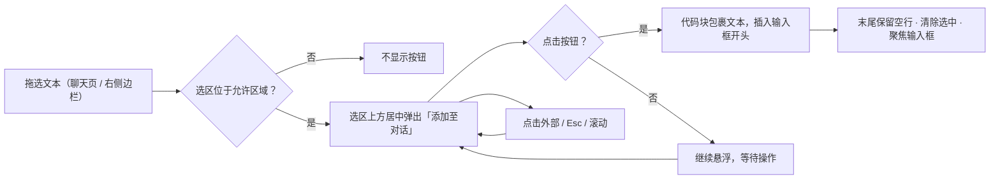

<div align="center">

# dsh-session-plus

**会话增强插件：模型选择菜单顶部实时显示模型提供商 · 选中文本一键以代码块加入输入框**

[](README.md)
[](README_en.md)


</div>

<!-- 预览图占位：补充截图 / GIF 后替换本注释，勿链接不存在的图片。
<p align="center"></p>
-->

**dsh-session-plus** 是 [DeepSeek Harness](https://github.com/deepseek-ai)（DSH）的会话增强插件，为聊天会话页提供两项轻量增强：

- 🏷 模型选择菜单顶部**实时展示**当前请求使用的模型提供商
- ✂️ 选中任意文本，一键以 Markdown 代码块形式**加入输入框开头**

> [!NOTE]
> **自 v0.4.0 起，「打开工作区」已从本插件移除。** DSH `0.1.5-rc.1` 已内置功能更完整的 **Open In…** 分体按钮（会话页头部右上角），可在已安装的目录应用中打开当前会话的 workspace；本插件不再重复提供该能力。本插件继续保留提供商展示和选文插入功能。

## 📑 目录

- [✨ 功能特性](#-功能特性)
- [🚀 快速开始](#-快速开始)
- [📖 使用说明](#-使用说明)
- [🧪 测试](#-测试)
- [🗂 项目结构](#-项目结构)
- [🛠 技术栈](#-技术栈)
- [🧭 路线图](#-路线图)
- [📄 许可证](#-许可证)

---

## ✨ 功能特性

### 1️⃣ 模型提供商头部

| 特性 | 说明 |
|---|---|
| 菜单头部展示 | 模型选择菜单最上方注入 `提供商：xxx` 说明行，一眼看清当前请求走哪家 |
| 显示名优先 | 使用模型目录中的提供商显示名（与菜单内分组标题同源）；目录缺失时回退原始 provider id |
| 实时跟随 | 菜单打开期间订阅会话模型目录，切换模型 / 提供商后头部即时更新 |
| 空态占位 | 目录尚未加载出选中时显示「—」，加载完成后自动变为提供商名 |
| 双语文案 | 随界面语言自动切换（简体中文 / English） |
| 只读无侵扰 | 纯展示、不可交互、不可聚焦；不触碰自带菜单的行为与样式，`/model` 弹出选择器保持原样 |

### 2️⃣ 选中文本 → 添加至对话

| 特性 | 说明 |
|---|---|
| 悬浮按钮 | 在**聊天页消息区**或 **官方 / better-sidebar 右侧预览**中选中文本，选区上方居中弹出「添加至对话」；顶部空间不足自动翻转到下方 |
| 开头插入 | 点击后以 Markdown 代码块（无语言标注围栏）插入**输入框开头**；已有草稿保留在块后（空一行分隔） |
| 末尾空行 | 插入结果整体末尾保留一行空行，便于后续直接续写 |
| 固定三反引号 | 围栏一律为 ```` ``` ````（产品要求只展示 ```` ``` ````） |
| 标准工具栏行为 | 点击外部 / Escape / 选区折叠 / 消息区滚动即隐藏；滚动停止且选区重新入屏自动恢复；点击后清除选中、隐藏按钮、聚焦输入框 |
| 范围克制 | 仅在所属聊天消息区与右侧预览触发；输入框、侧栏、设置页等其余区域不弹按钮 |
| 不限制长度 | 整段原样包裹，无长度上限 |



---

## 🚀 快速开始

### 1. Web 端安装

```bash
cd <absolute-path-to-plugin> && pnpm install
dsh plugin --profile web add "dsh-session-plus@link:<absolute-path-to-plugin>"
```

### 桌面端安装

当前版本：**v0.4.2**。先完全退出 DeepSeek Harness，再使用应用自带 CLI 安装到 `desktop` profile；旧 Web CLI 不能管理该保留 profile。

```bash
"<path-to-desktop-cli>" plugin --profile desktop add "dsh-session-plus@link:<absolute-path-to-plugin>"
```

macOS 默认安装位置的 CLI 为 `/Applications/DeepSeek Harness.app/Contents/Resources/runtime/cli/bin/dsh`。插件路径可含空格，保留命令中的引号。安装后重新打开桌面应用。

卸载同样需退出应用，再运行：

```bash
"<path-to-desktop-cli>" plugin --profile desktop remove dsh-session-plus
```

### 2. Web 端重启并验证

本插件为 **bundle 层插件**，安装后需重启 `dsh web` 才生效：

```bash
# 终端中 Ctrl+C 停止后重新启动
npm exec @deepseek-ai/dsh web
```

重启后打开任意会话：

- 点击输入框的模型选择按钮，菜单顶部显示当前提供商
- 在消息区拖选文本，选区上方出现「添加至对话」

> [!NOTE]
> 会话页头部右上角若出现「Open In…」按钮，那是 **DSH 自带**能力，与本插件无关。

### 升级与回滚

<details>
<summary>点击展开</summary>

**v0.4.2**：适配 DSH 桌面端 `0.2.0-rc.2` 的分层模型菜单和富文本输入框；限制 DOM 操作到所属会话，避免主会话与侧会话串用提供商或草稿。修复同一位置重新选中及滚动后按钮不恢复，支持官方右侧栏预览，清理卸载后的菜单头部与监听器。

**升级**：重新运行对应 profile 的安装命令。Web 端重启 `dsh web`；桌面端完全退出后安装并重新打开。

**回滚**：

```bash
dsh plugin --profile web remove dsh-session-plus
# 重启 dsh web 完成卸载
```

</details>

---

## 📖 使用说明

### 模型提供商头部

- **位置**：模型选择菜单最顶端（菜单开启即出现）。
- **内容**：`提供商：<显示名>`；目录缺失该提供商时显示原始 id；未加载出选中时显示「—」。
- **实时性**：打开期间切换模型 / 提供商，头部立即刷新；关闭菜单或卸载组件时清理头部，下次开启重新注入。
- **无副作用**：模型列表滚动、推理等级、键盘导航均不受影响；`/model` 弹出选择器无注入。

### 选中文本 → 添加至对话

- **触发**：在聊天页消息区（助手回复或用户消息）或官方 / better-sidebar 右侧预览中按住鼠标拖选文本，松开后选区上方出现「添加至对话」。
- **插入结果**：点击后输入框开头出现 ``` 包裹的代码块；已有草稿保留在块后（空一行分隔）；整体末尾保留一行空行。
- **隐藏时机**：点击外部、按下 Escape、选区折叠、滚动消息区即隐藏；滚动停止且选区重新出现在屏幕中时自动恢复；点击按钮后自动清除选中并聚焦输入框。
- **边界**：输入框 / 左侧会话列表 / 设置页内的选中不会触发。只读或正在提交的输入框不允许插入；内嵌会话选文只写入它自己的草稿，普通右侧预览写入所属主会话。 iframe 内部选区不在本插件支持范围内。

> [!NOTE]
> 围栏一律为三个反引号。选中文本本身含三个反引号时，可能影响该代码块在 Markdown 中的渲染，属已知限制。

### 支持范围

| 项目 | 范围 |
|---|---|
| DSH | 桌面 `0.2.0-rc.2`；保留旧版 Web 的 `menu` / textarea 接口兼容 |
| 平台 | 官方桌面前端由浏览器夹具验证；Windows 原生桌面未实测 |
| 浏览器 | 现代 Chrome / Safari / Edge |

---

## 🧪 测试

```bash
npm test
```

共 **21 项单元测试 + 6 项浏览器回归测试**。浏览器测试需要验收环境提供 DSH 官方运行时与 Playwright；普通 `npm test` 会跳过这 6 项。启用夹具的命令如下（仅操作临时页面，不调用模型）：

```bash
SESSION_PLUS_TEST_RUNTIME="<path-to-extracted-desktop-dsh>" \
SESSION_PLUS_TEST_PLAYWRIGHT="<path-to-playwright-package>" \
SESSION_PLUS_TEST_BROWSER="<path-to-chromium-executable>" \
node --test test/*.test.mjs
```

测试覆盖：

- **提供商名解析**：显示名优先 / 缺失回退原始 id / 空态占位符 / 空分组与空名称容错
- **代码块插入**：围栏固定为 ```` ``` ```` / 开头拼接 / 空草稿 / 末尾空行幂等 / 含 ```` ``` ```` 文本仍用 ```` ``` ````
- **宿主半区挂载**：导出面精确为 `name` + `apply`（空实现、不声明 `inject`）—— 守护「宿主行必须保留」
- **浏览器运行时**：官方模型菜单、实时目录更新、多会话隔离、富文本 / textarea 焦点恢复、选区重显、侧栏与编辑区边界、Windows 标题栏避让与卸载清理
- **浏览器半区注册面**：`conversation.input.overlay` 两条注册、词典与样式 effect、模型服务缺失时选文功能仍注册

---

## 🗂 项目结构

```text
dsh-session-plus/
├── lib/
│   ├── client.js   # 浏览器半区：提供商头部 + 选中添加（单 bundle，2 条 overlay 注册）
│   ├── index.js    # 宿主半区：刻意保留的空 apply（让浏览器半区被 dsh-client-modules 发现）
│   ├── insert.js   # 选中文本 → 代码块拼接纯函数（可单测）
│   └── label.js    # 提供商名解析纯函数（可单测）
├── test/           # client / index / label / insert 单元测试与官方前端浏览器夹具
├── cordis.patch.yml
├── package.json
└── LICENSE
```

---

## 🛠 技术栈

| 类别 | 技术 |
|---|---|
| 运行时 | DeepSeek Harness（DSH `0.2.0-rc.2`）· Cordis 插件系统 |
| 语言 | 原生 JavaScript（ESM，无构建步骤） |
| 浏览器侧 | DSH client runtime（`@deepseek-ai/dsh-client-*`），单 bundle 注入 |
| 宿主侧 | 无运行时依赖：空 `apply` 宿主行，保留它是为了让浏览器半区被 `dsh-client-modules` 发现 |
| 样式 | DSH 主题变量（`--dsw-alias-*`），客户端生命周期内挂载并清理样式 |
| 测试 | Node 内置测试运行器（`node --test`） |

---

## 🧭 路线图

- [x] 模型选择菜单提供商头部（实时跟随 + 双语文案）
- [x] 选中文本 → 添加至对话（悬浮按钮 + 代码块插入）
- [x] 触发范围限定（所属聊天页 + 右侧预览）
- [x] 桌面富文本输入框、分层模型菜单与多会话隔离
- [x] 插入结果末尾空行
- [x] 移除「打开工作区」（DSH 已内置 Open In… 取代，保留另外两项功能）
- [ ] 选中文本内含围栏时的转义 / 容错处理
- [ ] 插入位置可选（开头 / 末尾 / 光标处）

---

## 📄 许可证

本项目基于 [MIT](LICENSE) 许可证发布（SPDX: `MIT`）。
