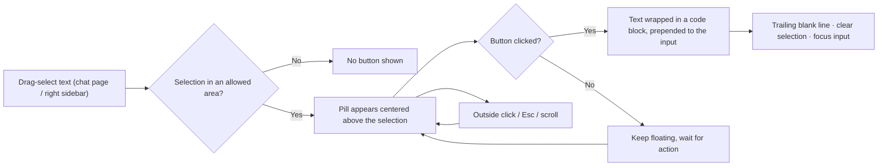

<div align="center">

# dsh-session-plus

**Session enhancement plugin: one-click open workspace · provider header in the model menu · selected text into conversation**

[](README.md)
[](README_en.md)


</div>

**dsh-session-plus** is a session enhancement plugin for [DeepSeek Harness](https://github.com/deepseek-ai) (DSH) that adds three lightweight boosts to the chat session page:

- 🗂 **Open** the current session's workspace directory in the system file manager
- 🏷 **Show** the active model provider at the top of the model selection menu, in real time
- ✂️ Turn any selected text into a Markdown code block, **prepended** to the input, with one click

## 📑 Table of Contents

- [✨ Features](#-features)
- [🚀 Quick Start](#-quick-start)
- [📖 Usage](#-usage)
- [🧪 Tests](#-tests)
- [🗂 Project Structure](#-project-structure)
- [🛠 Tech Stack](#-tech-stack)
- [🧭 Roadmap](#-roadmap)
- [📄 License](#-license)

---

## ✨ Features

### 1️⃣ Open Workspace

| Feature | Description |
|---|---|
| One-click access | A new icon button in the top-right of the chat header, left of the Session log download button |
| Platform-adaptive icon | Finder icon on macOS, folder icon on Windows / Linux (icon-only, no text) |
| Native platform commands | macOS `open` · Windows `explorer` · Linux `xdg-open` fallback |
| Accurate workspace | Reads the session's `session.header.cwd` — identical to the session's bash working directory |
| Result feedback | Bottom-right toast on failure only; success stays silent (the file manager opening is the feedback) |
| Security | The host API accepts loopback/trusted hosts + same-origin requests only; the browser sends only the sessionId, paths are resolved server-side |

### 2️⃣ Model Provider Header

| Feature | Description |
|---|---|
| Menu header | Injects a quiet `Provider: xxx` info row at the top of the model selection menu |
| Display name first | Uses the provider display name from the model directory (same source as the in-menu group titles); falls back to the raw provider id when missing |
| Live updates | Subscribes to the per-session model directory while the menu is open; the header refreshes instantly on switch |
| Empty state | Shows `—` before the directory reports a selection, then resolves automatically |
| Bilingual copy | Follows the UI locale (简体中文 / English) |
| Read-only, non-invasive | Pure display, never interactive or focusable; never touches the shipped menu's behavior or styles; the `/model` popup stays untouched |

### 3️⃣ Selected Text → Add to Conversation

| Feature | Description |
|---|---|
| Floating button | Select text in the **chat message area** or the **better-sidebar right panel** — an "Add to conversation" pill appears centered above the selection; flips below when there's no room above |
| Prepend insertion | Clicking inserts the text as a Markdown code block (no language tag) at the **start** of the input; existing draft stays after it, separated by a blank line |
| Trailing blank line | The result ends with a blank line so you can keep typing right after |
| Fixed triple-backtick fence | Always uses ```` ``` ```` (product requirement: only ```` ``` ```` is shown) |
| Standard toolbar behavior | Hides on outside click / Escape / collapsed selection / message-area scroll; returns automatically when scrolling stops and the selection is visible again; after clicking, the selection clears, the button hides, and the input regains focus |
| Scoped | Triggers only in the chat page and the better-sidebar right panel; selections in the input, sidebar, or settings never show it |
| No length limit | Wraps the whole selection, unbounded |



---

## 🚀 Quick Start

### 1. Install

```bash
cd <absolute-path-to-plugin> && pnpm install
dsh plugin --profile web add dsh-session-plus@link:<absolute-path-to-plugin>
```

### 2. Restart and verify

This is a **bundle-layer plugin**; restart `dsh web` to activate:

```bash
# Stop with Ctrl+C in the terminal, then start again
npm exec @deepseek-ai/dsh web
```

After restart, open any session:

- The "Open Workspace" icon button appears at the top-right (left of the Session log button)
- Click the composer's model select — the menu shows the current provider at the top
- Drag-select text in the message area — the "Add to conversation" button appears

### Upgrade & Rollback

<details>
<summary>Expand</summary>

**Upgrade**: client-layer changes apply on page refresh / HMR; bundle / host-layer changes require restarting `dsh web`.

**Rollback**:

```bash
dsh plugin --profile web remove dsh-session-plus
# Restart dsh web to finish uninstall
```

</details>

---

## 📖 Usage

### Open Workspace

- **Position**: session header top-right utilities, next to the Session log download button.
- **Icon**: Finder-style on macOS; folder icon on Windows / Linux.
- **Success**: no toast — the file manager opening is the feedback.
- **Failure**: red bottom-right toast with the reason (session missing, no workspace record, directory deleted, command failure, etc.).
- **Debounce**: the button disables while a request is in flight to avoid duplicate file-manager windows.

### Model Provider Header

- **Position**: first row of the model selection menu (appears as soon as the menu opens).
- **Content**: `Provider: <display name>`; raw provider id when the directory lacks the group; `—` before a selection is loaded.
- **Live**: switching models/providers while open refreshes the header immediately; closing the menu removes it, reopening re-injects it.
- **No side effects**: model list scrolling, effort levels, and keyboard navigation are untouched; the `/model` popup is not injected.

### Selected Text → Add to Conversation

- **Trigger**: drag-select text in the chat message area (assistant reply or user message) or in the better-sidebar right panel; the "Add to conversation" button appears above the selection on release.
- **Result**: clicking puts a ```-fenced code block at the **start** of the input; existing draft content stays after it (blank line separated); the result ends with a trailing blank line.
- **Dismiss**: outside click, Escape, collapsed selection, or scrolling the message area hides it; it returns automatically once scrolling stops and the selection is visible again; after clicking, the selection clears and the input regains focus.
- **Edges**: selections inside the input / sidebar / settings never trigger.

> [!NOTE]
> The fence is always three backticks. If the selected text itself contains three backticks, it may affect that block's Markdown rendering — a known limitation.

### Supported Scope

| Item | Scope |
|---|---|
| DSH | `0.1.1-rc.2` (current web profile) |
| OS | macOS / Windows (Linux via `xdg-open` fallback) |
| Browser | Modern Chrome / Safari / Edge on the same machine as `dsh web` |

---

## 🧪 Tests

```bash
npm test
```

**35** pure-function unit tests, all passing:

- **Host side**: platform command mapping, request trust checks, workspace path resolution, Windows exit-code tolerance
- **Provider label**: display-name priority / raw-id fallback / empty-state placeholder / tolerance for empty groups and names
- **Code-block insertion**: fence always ```` ``` ```` / prepend composition / empty draft / trailing-blank-line idempotency / ```` ``` ```` inside text still uses ```` ``` ````

---

## 🗂 Project Structure

```text
dsh-session-plus/
├── lib/
│   ├── client.js   # Browser half: open-workspace button + toasts + provider header + selected-text add (single bundle)
│   ├── index.js    # Host half: /session-plus/api open-workspace API + asset routes
│   ├── insert.js   # Selected text → code-block composition (unit-testable)
│   └── label.js    # Provider-label pure function (unit-testable)
├── assets/icons/   # finder.png / folder.svg platform icons
├── test/           # index / label / insert test suites
├── cordis.patch.yml
├── package.json
└── LICENSE
```

---

## 🛠 Tech Stack

| Category | Technology |
|---|---|
| Runtime | DeepSeek Harness (DSH `0.1.1-rc.2`) · Cordis plugin system |
| Language | Plain JavaScript (ESM, no build step) |
| Browser side | DSH client runtime (`@deepseek-ai/dsh-client-*`), injected as a single bundle |
| Host side | `@deepseek-ai/dsh-native-command` platform-command wrapper |
| Styling | DSH theme variables (`--dsw-alias-*`), zero custom stylesheets |
| Tests | Node built-in test runner (`node --test`) |

---

## 🧭 Roadmap

- [x] One-click open workspace (native platform commands + icons)
- [x] Model provider header (live updates + bilingual copy)
- [x] Selected text → add to conversation (floating button + code-block insertion)
- [x] Scoped triggers (chat page + better-sidebar right panel only)
- [x] Trailing blank line after insertion
- [ ] Escaping / tolerance for fences inside the selected text
- [ ] Insert position options (start / end / cursor)

---

## 📄 License

This project is released under the [MIT](LICENSE) license (SPDX: `MIT`).